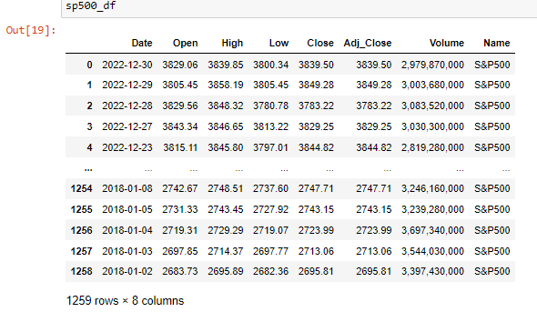
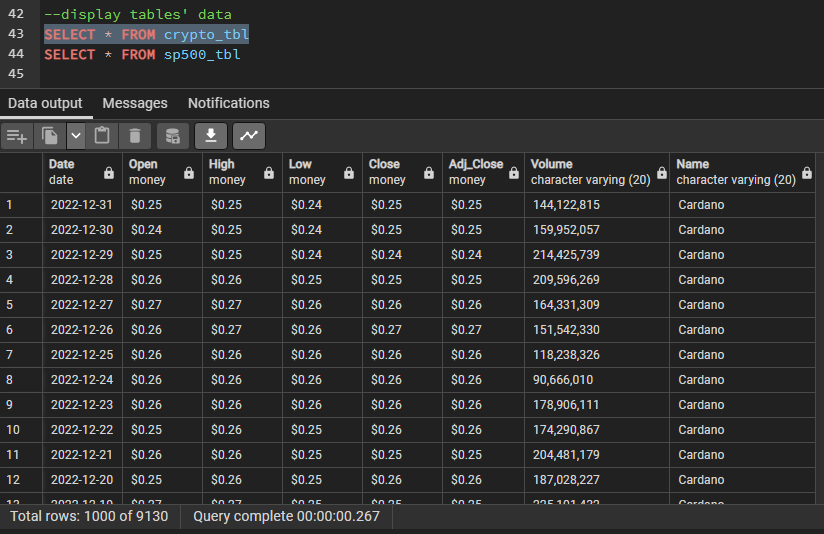

# Group 6 Final Project:  Cryptocurrency vs S&P 500 Analysis
Use machine learning, Python, PostgreSQL and Tableau to analyze and predict top 5 cryptocurrencies with top 5 S&P 500.  

*Team - Fareena Mughal, Emerset Farquharson, Kirti Henry, Hitha Das*

## Project Dashboard -TBD

## Project Links - TBD (future state - will include link to Tableau, slides, presentations)

## Overview 
Cryptocurrency, specifically Bitcoin, has seen a tremendous amount of growth in recent years, with many investors turning to it as an alternative to traditional investments like stocks. In this project, we will compare the performance of top 5 S&P 500, a stock market index that represents the performance of the top 500 publicly traded companies in the United States, to that of top 5 cryptocurrencies. 

The 5 cryptocurrencies used in this analysis are - 
1. Bitcoin (BTC) 
2. Ethererm (ETH)
3. Binance coin (BNB)
4. Cardano (ADA)
5. Dogecoin (DOGE)

The 5 S&P 500 used in the analysis are -
1. Apple Inc. (AAPL)
2. Microsoft Corp. (MSFT)
3. Amazon.com, Inc. ( AMZN)
4. Tesla, Inc. (TSLA)
5. Nvidia Corp. (NVDA)

We will use historical data on the prices of the top 5 cryptocurrencies and the top 5 companies in the S&P 500 to calculate their volatility. Standard deviation will be used as a measure of volatility and compare the results between the two asset classes. We will also use charts to visually represent the volatility of each asset over time.

## Purpose of the Project
The purpose of this analysis is to compare the performance of the top 5 cryptocurrencies with that of the top 5 companies in the S&P 500, specifically focusing on their volatility. Cryptocurrencies have gained popularity in recent years as an alternative investment option to traditional stocks. This analysis aims to evaluate the risk and potential returns of investing in these two different asset classes, using measures like volatility and machine learning predictive models.

## Resources
Below are the links to the datasets we used, sourced from Yahoo Finance:  
[S&P 500](https://finance.yahoo.com/quote/%5EGSPC/history?p=%5EGSPC) | 
[ADA](https://finance.yahoo.com/quote/ADA-USD?p=ADA-USD&.tsrc=fin-srch) | 
[BNB](https://finance.yahoo.com/quote/BNB-USD?p=BNB-USD&.tsrc=fin-srch) | 
[BTC](https://finance.yahoo.com/quote/BTC-USD?p=BTC-USD&.tsrc=fin-srch) | 
[DOGECOIN](https://finance.yahoo.com/quote/DOGE-USD?p=DOGE-USD&.tsrc=fin-srch) | 
[ETH](https://finance.yahoo.com/quote/ETH-USD?p=ETH-USD&.tsrc=fin-srch)

## Steps
- Source data (Yahoo Finance)
- Scraped/ cleaned/ created csv dataset and associated tables
- Query data using Python/Jupyter Notebook
- Push finalized CSV to AWS
- Used machine learning (regression model) for prediction
- Connect to cleaned CSVs using Tableau Public
- Analysis
- Visualization

## Segment 1
#### <ins>A description of the data</ins>  
After extracting the each of the 5 crypto datasets from Yahoo Finance using Python, we appended a column called "Name" that contains the name of the coin/ETF. This step was necessary as we concatenated the datasets into one master file, keeping the S&P 500 data in a separate one. 

ERD 

 

Here are some snapshots of our 2 datasets, as dataframes:  

1. Crypto Dataframe  
 
2. S&P 500 Dataframe  

After changing the datatypes of the columns e.g. changing the "Date" column to a DateTime type, "Open" to float etc, we provided a quick summary of each dataset, as shown below:

1. Crypto Summary  
 
2. S&P 500 Summary  

We exported both dataframes as CSV files, that we used pgAdmin to store the data in 2 tables created with respective datatypes, shown below:
1. Crypto Table  
 
2. S&P 500 Table  

#### <ins>Questions we plan to answer with the project</ins>  
1. Using a calculated measurement like Volatility, we want to show how high or low risk the stocks are.
2. Is there any correlation between the stock market and cryptocurrencies?
3. Using a regression machine learning model, we want to predict the prices of crypto or stock in the next X time.

## Dashboard
We will utilize Tableau to present data in the form of graphs, charts, and a narrative format, allowing viewers to interact with the information by selecting options via drop-down menus within Tableau.

Following are some sample charts with metrics and visualizations we aim to show in our final presentation -

https://prod-ca-a.online.tableau.com/t/group6crypto/views/Group-6-Crypto/Stock--Crypto-Analysis

## Segment 2

### Requirements - Project status, images, descriptions, and results (20 points)
                 - At least eight total commits per team member (20 points)
                 - A machine learning model, including a confusion matrix and accuracy score (20 points)
                 - Database that stores data for the project with at least two tables or collections (20 points)

[S&P500 and Crypto Comparison - Tableau workbook](https://prod-ca-a.online.tableau.com/t/group6crypto/views/Group-6-Crypto/Stock--Crypto-Analysis/9174ae65-7ed2-4a9b-8553-8d3dc4b661be/9e487dcf-9d3c-49b7-8c14-bef45f0d14de)

